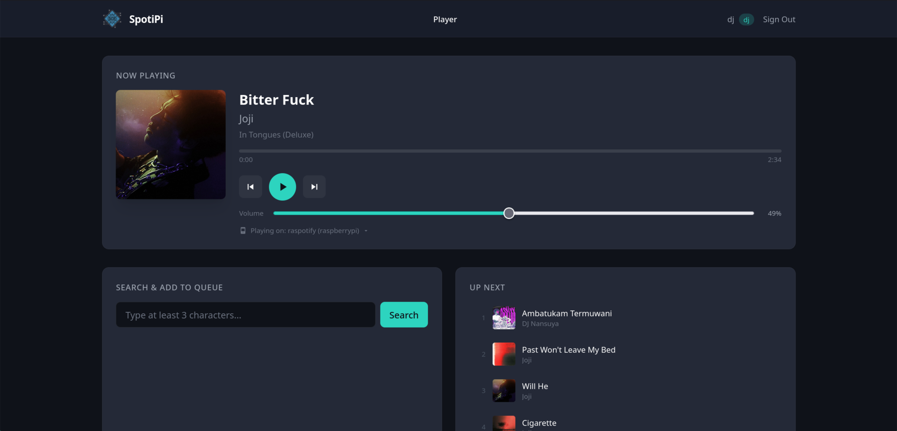

# Spotipi

A web application for shared music playback. Authorized users can control a single shared speaker through a web UI — the backend drives a Raspberry Pi that streams YouTube audio via `mpv` + `yt-dlp`.



## Architecture

```
[Browser] ──HTTP──► [Oracle backend (Express + Prisma/SQLite)]
                           │
                           ├─ YouTube Data API v3 (search, video details)
                           │
                           └──WebSocket──► [Pi daemon (Node)]
                                                  │
                                                  └─► mpv --no-video
                                                         (fed by yt-dlp URL)
```

The Pi opens an outbound WebSocket to the Oracle backend (no inbound firewall holes needed on the LAN). Player state — current track, position, volume, queue, recently-played — lives in the Oracle SQLite database. The Pi is a thin playback slave.

## Features

- **Playback controls** — play, pause, skip, previous, volume slider
- **Queue management** — view upcoming tracks and add new ones
- **YouTube search** — search YouTube and queue videos directly
- **Recently played** — browse listening history
- **Role-based access** — admin, DJ, and viewer roles with appropriate permissions
- **User management** — admins can create users, assign roles, and reset passwords
- **Audit logging** — all actions logged with actor, action, target, timestamp, and IP address
- **Secure by default** — bcrypt passwords, HTTP-only cookies, rate limiting, WebSocket token auth

## Tech Stack

- **Frontend:** React, TypeScript, Vite, Tailwind CSS, TanStack Query
- **Backend:** Node.js, Express, TypeScript, Prisma, SQLite, `ws`
- **Pi daemon:** Node.js, `ws`, `mpv` (IPC), `yt-dlp`
- **Monorepo** managed with npm workspaces (pi-daemon is a separate package)

## Prerequisites

- Node.js (v20+)
- npm
- A YouTube Data API v3 key ([Google Cloud Console](https://console.cloud.google.com/apis/credentials))
- A Raspberry Pi (or any Linux box) with `mpv` and `yt-dlp` installed for playback

## Setup (backend + frontend)

1. **Clone and install:**

   ```bash
   git clone <repo-url>
   cd spotipi
   npm install
   ```

2. **Configure environment variables:**

   ```bash
   cp backend/.env.example backend/.env
   ```

   Edit `backend/.env`:
   - `SESSION_SECRET` — random string for signing sessions
   - `YOUTUBE_API_KEY` — YouTube Data API v3 key
   - `PI_BRIDGE_SECRET` — shared secret; the Pi daemon must send the same value

3. **Initialize the database:**

   ```bash
   npx -w backend prisma db push --schema=../prisma/schema.prisma
   npm -w backend run db:seed
   ```

   Creates two default accounts:

   | Username | Password   | Role  |
   |----------|------------|-------|
   | `admin`  | `admin123` | admin |
   | `dj`     | `dj123`    | dj    |

   **Change these passwords after first login.**

4. **Start the dev servers:**

   ```bash
   npm -w backend run dev
   npm -w frontend run dev
   ```

   - Frontend: http://localhost:5173
   - Backend: http://localhost:3001

## Raspberry Pi setup

See [`pi-daemon/README.md`](pi-daemon/README.md) for the full one-time setup. High level:

1. Install `mpv`, `yt-dlp`, Node 20.
2. Clone the repo on the Pi, `cd pi-daemon && npm install && npm run build`.
3. Copy `.env.example` to `.env`; set `ORACLE_WS_URL=wss://<your-host>/ws/pi` and `PI_BRIDGE_SECRET=<same as backend>`.
4. Install the bundled systemd unit (`systemd/spotipi-pi.service`) and `systemctl enable --now spotipi-pi`.

## Production

An `ecosystem.config.cjs` is included for running the backend with PM2:

```bash
npm -w backend run build
npm -w frontend run build
pm2 start ecosystem.config.cjs
```

### Reverse proxy note

The WebSocket endpoint `/ws/pi` (configurable via `PI_WS_PATH`) must be proxied with `Upgrade` / `Connection` headers forwarded. Example nginx snippet:

```nginx
location /ws/pi {
    proxy_pass http://127.0.0.1:3001;
    proxy_http_version 1.1;
    proxy_set_header Upgrade $http_upgrade;
    proxy_set_header Connection "upgrade";
    proxy_read_timeout 3600s;
}
```

## CI/CD

Pushes to the `youtube` branch trigger `.github/workflows/deploy.yml`:

- **`deploy-oracle`** — SSHes into the Oracle server, pulls, runs `prisma db push`, rebuilds backend + frontend, restarts PM2.
- **`deploy-pi`** — runs on a self-hosted runner on the Pi (label `pi`), rebuilds the daemon, and `sudo systemctl restart spotipi-pi`.

Required GitHub secrets: `SSH_HOST`, `SSH_USER`, `SSH_PRIVATE_KEY` (all for the Oracle deploy).

## Roles

| Role   | Permissions                                                    |
|--------|----------------------------------------------------------------|
| admin  | User management, playback, audit logs                          |
| dj     | Playback controls (play, pause, skip, queue, volume)           |
| viewer | View current playback state (read-only)                        |

## API

| Group   | Endpoints                                                                                              |
|---------|--------------------------------------------------------------------------------------------------------|
| Auth    | `POST /api/auth/login`, `POST /api/auth/logout`, `GET /api/auth/me`                                    |
| Users   | `GET /api/users`, `POST /api/users`, `PATCH /api/users/:id`, `POST /api/users/:id/reset-password`      |
| Player  | `GET /state`, `POST /play`, `POST /pause`, `POST /next`, `POST /previous`, `PUT /volume`, `GET /queue`, `POST /queue`, `DELETE /queue/:id`, `GET /recently-played` (all under `/api/player`) |
| Search  | `GET /api/search?q=...`                                                                                |
| Audit   | `GET /api/audit-logs`                                                                                  |
| Pi WS   | `GET /ws/pi?token=<PI_BRIDGE_SECRET>` (WebSocket upgrade only)                                         |

## Project Structure

```
spotipi/
├── frontend/          # React + Vite app
│   └── src/
│       ├── pages/
│       ├── components/
│       └── lib/
├── backend/           # Express API server + Pi WebSocket bridge
│   └── src/
│       ├── routes/
│       ├── modules/
│       │   ├── youtube/  # YouTube Data API v3 client
│       │   ├── player/   # State + queue
│       │   └── pi/       # WebSocket bridge + event→state glue
│       └── middleware/
├── pi-daemon/         # Standalone Node daemon for the Pi (mpv + yt-dlp)
│   ├── src/
│   └── systemd/
└── prisma/            # Database schema & seed
```

## License

MIT
